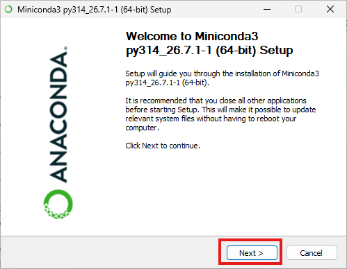
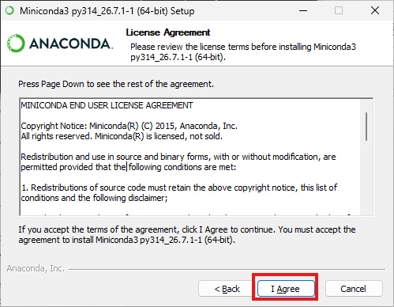
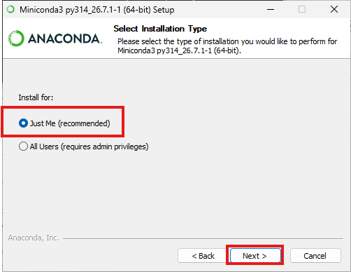
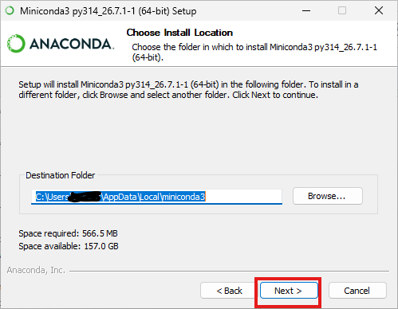
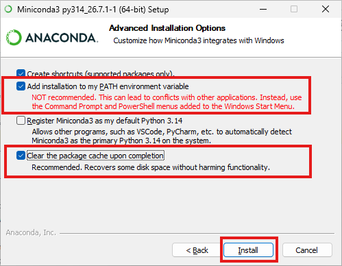
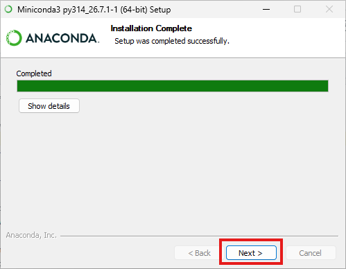
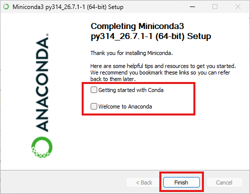

[< Revenir à la page d'Accueil](../readme.md)

# Configurer sa machine perso ou une machine UGA (`Windows 11`)

NB : si vous êtes sur une machine perso tournant sur Windows 10, il est conseillé d'utiliser plutôt les machines de l'UGA. En effet, les mises à jours de sécurité [ne sont plus publiées pour Windows 10](https://www.microsoft.com/fr-fr/windows/end-of-support), ce qui représente un risque.

## Etape 1 : Installer Miniconda

Télécharger Miniconda depuis le [site officiel](https://www.anaconda.com/download/success), et procéder à l'installation **en suivant très précisément les étapes ci-dessous**. 

⚠️ à l'étape 5, les cases ne sont pas cochées par défaut.

<details>
<summary>Étape 1</summary>


</details>
<details>
<summary>Étape 2</summary>


</details>
<details>
<summary>Étape 3</summary>


</details>
<details>
<summary>Étape 4</summary>


</details>
<details>
<summary>Étape 5</summary>


</details>
<details>
<summary>Étape 6</summary>


</details>
<details>
<summary>Étape 7</summary>


</details>


## Etape 2 : Création du dossier de travail

⚠️**On ne travaille pas dans le dossier de téléchargements ou n'importe-où sur le disque dur.** 

Nous allons créer un dossier de travail qui contiendra l'ensemble des fichiers et travaux du cours. Ce dossier portera le même nom chez tout le monde (`intro-python`).

<details>
<summary>Sur une machine UGA</summary>

Le dossier de travail sera situé sera situé dans l'espace disque personnel accessible depuis n'importe quel ordinateur UGA.

</details>

<details>
<summary>Sur sa machine perso</summary>

Le dossier de travail sera situé sera situé dans le répertoire utilisateur (aussi appelé *Home*).

</details>

Dans la barre de recherche windows en bas de l'écran, taper *Terminal* et lancer l'application Terminal.

Copier-coller la commande suivante et la lancer en appuyant sur la touche entrée :
```powershell
Invoke-RestMethod "https://raw.githubusercontent.com/thomaslvz/intro-python-student/refs/heads/main/setup/setup.ps1" | Invoke-Expression
```
Cela va configurer python et créer un dossier de travail pour ce cours.

Tant que le curseur en bas du terminal clignote, l'installation est en cours. Au bout de quelques minutes, on doit voir le message ci-dessous :
> ```bash
> ============================================================
> SETUP OK
> Your Python environment is ready.
> ============================================================
> ```
Si cela ne fonctionne pas, appeler l'enseignant. Si cela fonctionne, fermer le terminal.

Pour finir, localiser le dossier `intro-python` sur l'ordinateur : 
<details>
<summary>Sur une machine UGA</summary>

Ouvrir l'explorateur de fichiers, cliquer sur `Ce PC` puis sur son espace personnel dans les *Emplacements réseaux*. On doit voir le dossier `intro-python`. Si ce n'est pas le cas, appeler l'enseignant.

</details>

<details>
<summary>Sur sa machine perso</summary>

Ouvrir l'explorateur de fichiers, cliquer sur `Ce PC` puis sur le disque dur qui contient Windows. Aller ensuite dans *Utilisateurs* et cliquer sur son nom d'utilisateur. On doit voir le dossier `intro-python`. Si ce n'est pas le cas, appeler l'enseignant.

</details>

**Retenir que ce dossier sera le dossier de travail pour tout ce cours.**
